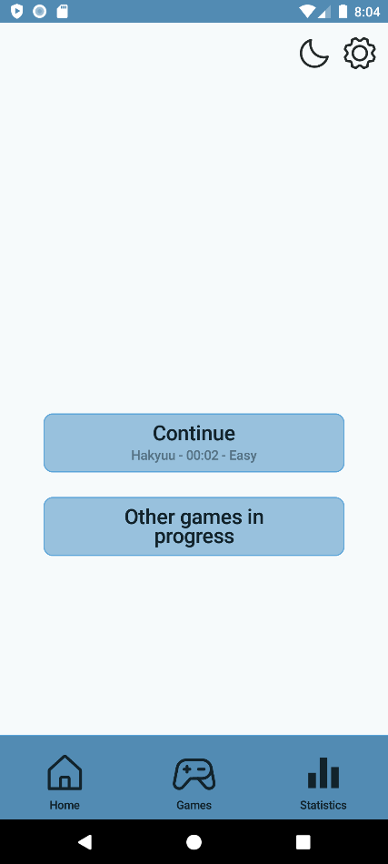
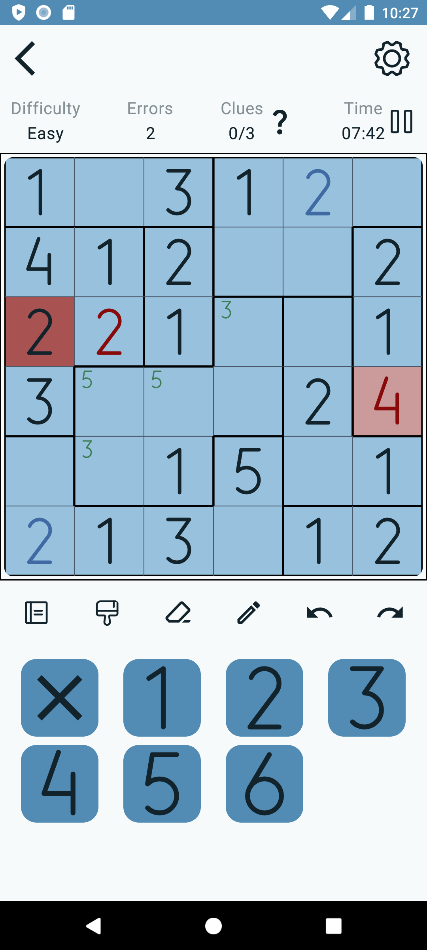

# Logic Games

This is Android app is collection of Sudoku like logic games. Right now the only game available is [Hakyuu](https://www.janko.at/Raetsel/Hakyuu/index.htm). This app is the end result of my final degree thesis and it's free, open-source software.

## Features

Some of its features are:

-   **Modern and Welcoming Interface**: Enjoy a user-friendly and visually appealing interface that enhances your gaming experience.

-   **Customizable Game Boards**: Create both random and personalized game boards to suit your preferences.

-   **Intuitive Gameplay**: Experience smooth and intuitive gameplay mechanics that are easy to understand and engage with.

-   **Multiple Game States**: Manage multiple game states simultaneously, allowing you to explore different strategies and paths. Errors are not highlighted automatically when you have more than one state.

-   **Board snapshots**: Automatically take snapshots of the states to visualize them better when choosing a state. Also when choosing a on going game.

-   **Cell Notation and Coloring**: Utilize tools to note and color cells for better game management and strategy planning.

-   **Undo and Redo Movements**: Easily correct mistakes with the ability to undo and redo your moves.

-   **Extensive stats**: See all the statistics you always wanted to see about your logic games.

-   **Dark and Light Modes.**

## Planned Features

-   Option to not show errors automatically.

-   Option to mark all cells with the selected value.

-   Option to mark the region the cell you selected is on.

-   Option to delete invalid notes when updating a value.

-   Option to disallow snapshots.

-   Graphs in the statistics section.

Enventually:

-   More games.

-   Data importing/exporting.

-   Better board creation algorithm (I have ideas to improve it).

## Requirements

-   At least Android 8.0 (Oreo).
-   There should be no screen limitations. Please make an issue if your screen is not compatible.
